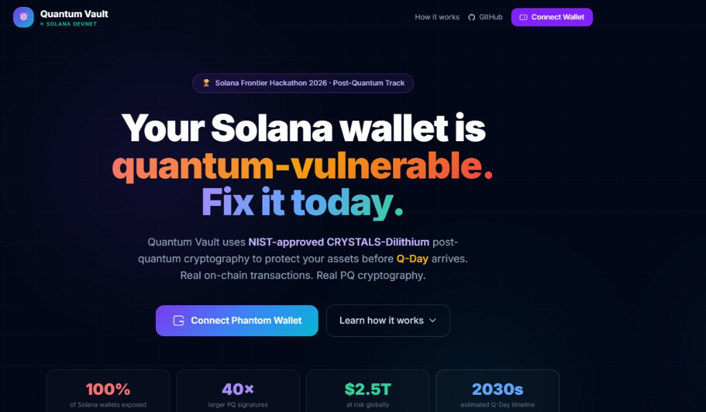
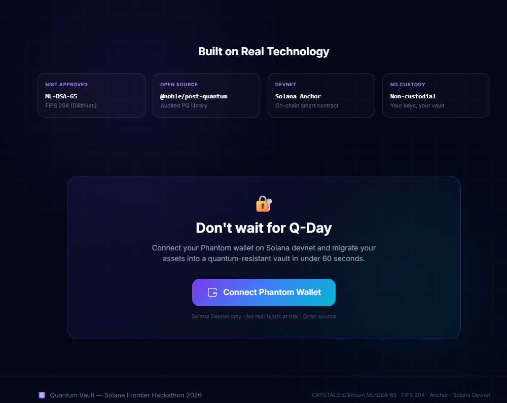
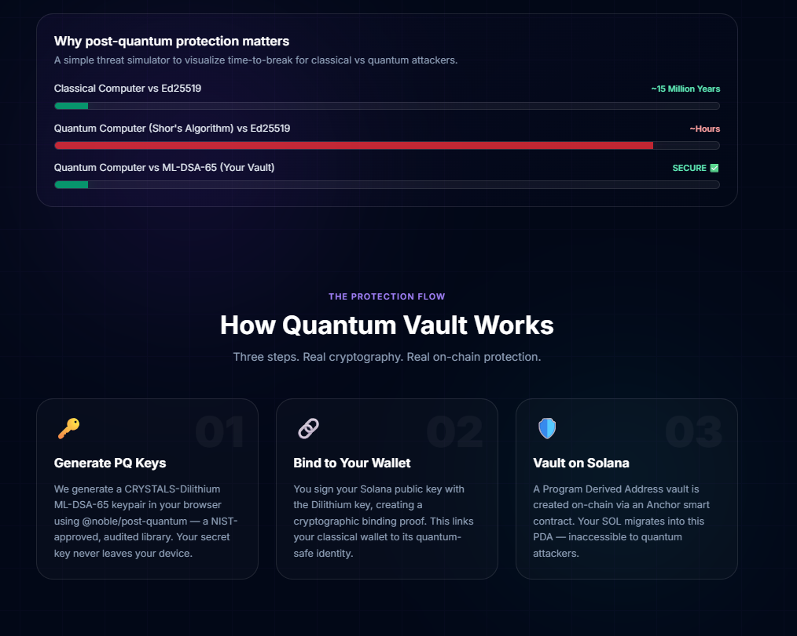
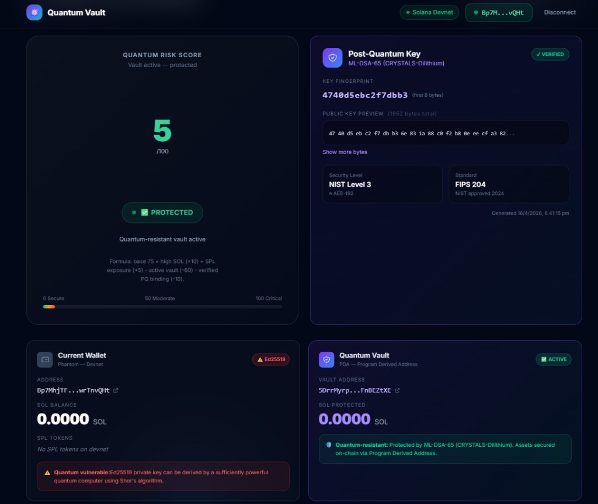

# Quantum Vault
### Solana Frontier Hackathon 2026 - Post-Quantum Track

Quantum Vault is a non-custodial Solana vault that adds a post-quantum ownership layer using ML-DSA-65 (CRYSTALS-Dilithium). It helps users migrate assets into an on-chain PDA vault while binding that vault to a quantum-safe identity generated in-browser.

## What This Project Does

- Protects assets behind a Solana program-controlled PDA vault.
- Generates a real post-quantum keypair (ML-DSA-65) in the browser.
- Creates and verifies a PQ binding proof against the connected wallet address.
- Stores only a hash of the PQ public key on-chain (`pq_pubkey_hash`).
- Supports real `initialize`, `deposit`, and `withdraw` devnet flows with Phantom.

## Why It Matters

Current wallet signatures rely on Ed25519, which is vulnerable in a large-scale quantum future. Quantum Vault demonstrates a practical hybrid approach today:

- Keep standard Solana transaction authority for compatibility.
- Add post-quantum cryptographic identity and binding for forward-looking security.

## UI Preview

Add project screenshots to `docs/images/` (recommended names below) and they will render in GitHub automatically.






## Architecture

### Frontend (Next.js + TypeScript)
- Wallet connection, dashboard, and protection workflow.
- Browser-side ML-DSA keygen/sign/verify via `@noble/post-quantum`.
- Solana interactions via `@solana/web3.js` and Anchor client.

### On-chain Program (Anchor, Rust)
- PDA vault account per wallet owner.
- Instructions:
  - `initialize_vault(pq_pubkey_hash)`
  - `deposit_sol(amount)`
  - `withdraw_sol(amount)`
- Owner constraints enforce non-custodial control (`has_one = owner`).

### Data Model
- On-chain: owner, `pq_pubkey_hash`, `is_protected`, deposited SOL, timestamp, bump.
- Local browser: PQ public/secret keys and metadata (demo storage).

## Protect Flow (End-to-End)

1. Generate ML-DSA-65 keypair in-browser.
2. Sign wallet address with PQ secret key.
3. Verify PQ signature locally.
4. Hash PQ public key using SHA-256.
5. Initialize on-chain vault PDA and store hash.
6. Deposit SOL from wallet to PDA vault.
7. Persist PQ keys locally for withdrawal proof in the session.

## Tech Stack

| Layer | Technology |
|---|---|
| App framework | Next.js 16 (App Router) + TypeScript |
| Styling | Tailwind CSS v4 |
| Wallet | Phantom via Solana wallet adapter |
| PQ cryptography | `@noble/post-quantum` (ML-DSA-65 / FIPS 204) |
| Solana SDK | `@solana/web3.js` |
| Smart contract | Anchor (Rust) |
| Network | Solana devnet |

## Project Structure

```text
quantum-vault/
├── app/
│   ├── layout.tsx
│   ├── providers.tsx
│   ├── page.tsx
│   └── vault/page.tsx
├── components/
│   ├── ConnectWallet.tsx
│   ├── VaultDashboard.tsx
│   ├── ProtectButton.tsx
│   ├── QuantumRiskScore.tsx
│   ├── PQKeyDisplay.tsx
│   └── AssetList.tsx
├── lib/
│   ├── pq-crypto.ts
│   ├── solana.ts
│   ├── vault-program.ts
│   └── idl/quantum_vault.json
└── program/
    ├── Anchor.toml
    └── programs/quantum-vault/src/lib.rs
```

## Quick Start (Frontend)

```bash
npm install
npm run dev
```

Open `http://localhost:3000`.

Notes:
- If port 3000 is busy, Next.js may use 3001.
- If the on-chain program is not reachable, the app can still show a simulated UX path for demo continuity.

## Deploying the Program

Real on-chain transactions require a deployed Anchor program on devnet.

### Option A: Solana Playground (fastest)

1. Open [Solana Playground](https://beta.solpg.io) and create/open project.
2. Paste program code into `src/lib.rs`.
3. Set endpoint to `devnet`.
4. Build and deploy.
5. Copy deployed Program ID.
6. Sync that ID in all four places:
   - `program/programs/quantum-vault/src/lib.rs` `declare_id!`
   - `program/Anchor.toml` `[programs.devnet].quantum-vault`
   - `lib/vault-program.ts` `PROGRAM_ID`
   - `lib/idl/quantum_vault.json` `metadata.address`

### Option B: Local Anchor Toolchain (WSL recommended on Windows)

Install Rust, Solana CLI, Anchor, then:

```bash
cd program
anchor build
anchor keys list
anchor deploy --provider.cluster devnet
```

Then sync Program ID to the same four files listed above.

## Running the Full Demo

1. Connect Phantom wallet (devnet).
2. Request devnet SOL (airdrop).
3. Click `Protect Now`.
4. Confirm wallet transactions.
5. Verify explorer links for initialize/deposit/withdraw.

## Security Model

- Hybrid model: PQ operations are browser-side; on-chain stores commitment hash only.
- No native on-chain ML-DSA verification in this demo.
- Vault operations remain owner-authorized through Solana signatures.
- No admin override path in the contract.

### Non-custodial Checklist

- [x] PQ keypair generated client-side.
- [x] PQ secret key not sent to backend.
- [x] Only PQ public key hash is stored on-chain.
- [x] Vault operations constrained to owner signer.
- [ ] Production key storage is pending (demo uses localStorage).

## Known Limitations

- PQ secret key storage uses browser localStorage for hackathon demo speed.
- If browser storage is cleared, user loses local PQ key material.
- Devnet environment only.

## Troubleshooting

### Wallet not connecting
- Ensure Phantom is installed in the same browser where app is open.
- Unlock Phantom and keep network set to devnet.
- Refresh app after extension install.

### Windows dev issues
- Use PowerShell commands line-by-line.
- Prefer `npm run dev` (Webpack) over Turbopack for stability.
- If watcher issues occur in OneDrive, move project to a non-synced folder.

## References

- [Solana Explorer (devnet)](https://explorer.solana.com/?cluster=devnet)
- [Anchor Framework](https://www.anchor-lang.com/)
- [Noble Post-Quantum](https://github.com/paulmillr/noble-post-quantum)
- [NIST FIPS 204 (ML-DSA)](https://doi.org/10.6028/NIST.FIPS.204)
